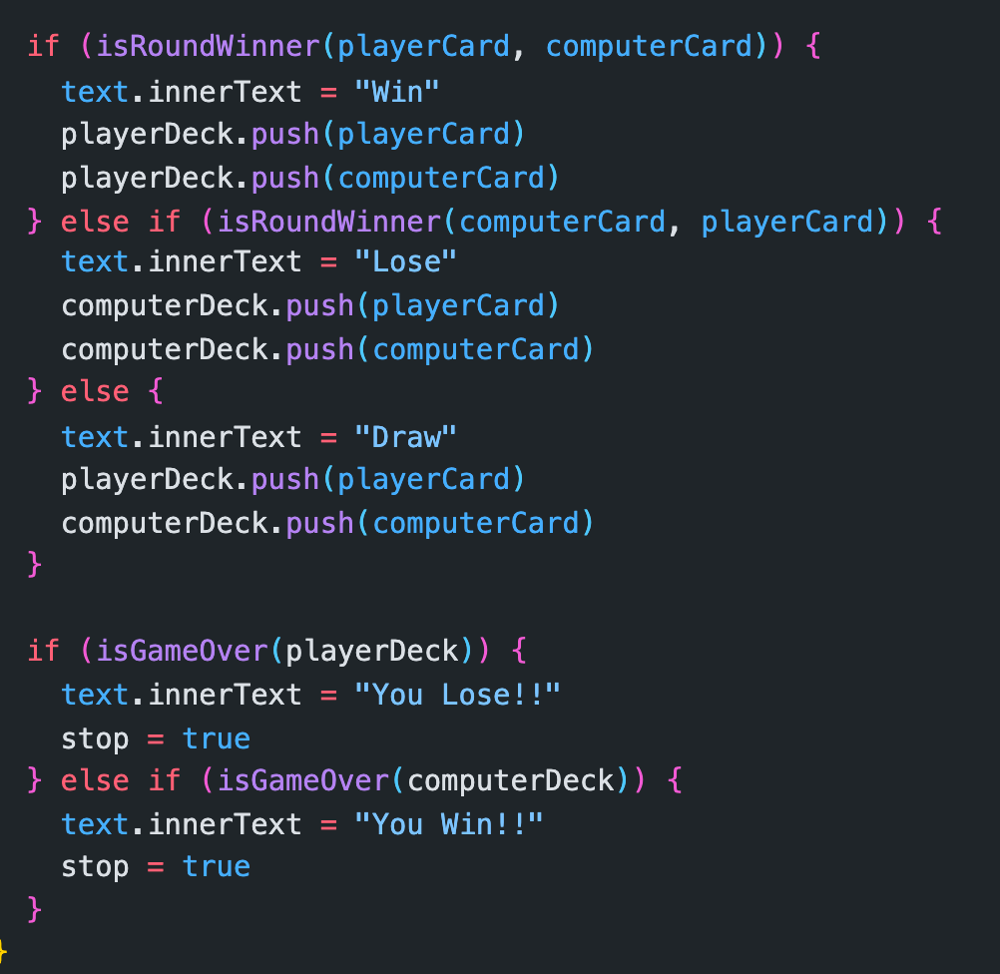
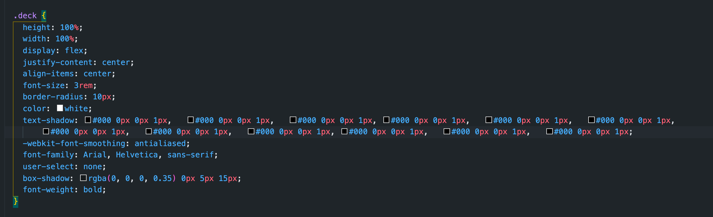

# Mintbean Hackathon Project

For my hackathon project I constructed the game of War using HTML, CSS, and Javascript.

The game rules are simple:
The goal is to be the first player to win all 52 cards.

# THE DEAL
The deck is divided evenly, with each player receiving 26 cards, dealt one at a time, face down. Anyone may deal first. Each player places their stack of cards face down, in front of them.

# THE PLAY
Each player turns up a card at the same time and the player with the higher card takes both cards and puts them, face down, on the bottom of his stack.

If the cards are the same rank, it is War. Each player turns up one card face down and one card face up. The player with the higher cards takes both piles (six cards). If the turned-up cards are again the same rank, each player places another card face down and turns another card face up. The player with the higher card takes all 10 cards, and so on.

# HOW TO KEEP SCORE
The game ends when one player has won all the cards.

# Javascript

The functionality of my application was done in Javascript. The below code snippet shows how I create if and else statements to determine who the winner of each round would be. 

# CSS 
For the styling of my application I used downloaded images to give the player a design that looks as if they are playing on a card table. I did this by assigning each deck a class and downloading images to use for each set of cards.

